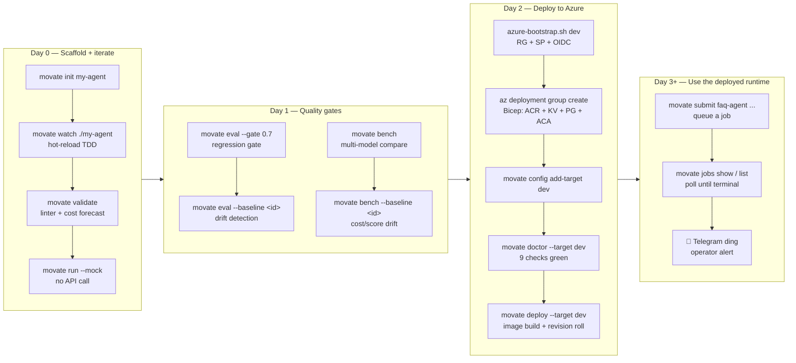

# Developer flow: from `movate init` to running on Azure

This is the canonical "how do I use movate" walkthrough for new projects.
Pairs with [docs/v1.0-overview.md](v1.0-overview.md) (the system
architecture).

## The flow



## Day 0 — scaffold + iterate

```bash
# Scaffold a fresh agent from the packaged template.
# Creates agent.yaml + prompt.md + schema/ + dataset.jsonl + evals/judge.yaml.example
$ movate init my-agent

# Hot-reload TDD: poll filesystem; on any save, re-run validate
# (linter + cost forecast + schema). Save the prompt, see the diff in <1s.
$ movate watch ./my-agent

# Manual validate. Includes:
#  - Pydantic schema checks (agent.yaml shape, semver, api_version)
#  - Prompt linter (4 rules: undeclared input ref, empty prompt,
#    missing JSON instruction, no output schema reference, tiny prompt)
#  - Cost forecast: estimates eval-run cost from dataset size + pricing table
$ movate validate ./my-agent

# Run against the deterministic MockProvider — no API keys, no network.
# Used to smoke-test wiring before paying for real provider calls.
$ movate run ./my-agent "test input" --mock

# Real run against the configured provider (OPENAI_API_KEY etc. in .env).
# Output goes to stdout as JSON; --output text for human-friendly view.
$ movate run ./my-agent "what is movate?"
```

## Day 1 — quality gates

```bash
# Eval against a dataset (evals/dataset.jsonl) with a judge from
# evals/judge.yaml. Exit 1 on score below --gate.
# --gate-mode mean | min | p10 controls aggregation across N runs/case.
$ movate eval ./my-agent --gate 0.7 --runs 3

# Drift detection: diff this run against a stored EvalRecord by id.
# CI-gateable: exits 1 on regression past --regression-tolerance.
$ movate eval ./my-agent --baseline <eval-id> --regression-tolerance 0.05

# Multi-model benchmark. Compares cost / latency p50/p95 / score
# across N providers. Defaults pulled from movate.yaml: bench.models.
# Cross-family judge enforcement: judge ≠ tested family.
$ movate bench ./my-agent "input" \
      -m openai/gpt-4o-mini-2024-07-18 \
      -m anthropic/claude-haiku-4-5-20251001 \
      --runs 3

# Persists a BenchRecord automatically; surfaces bench_id in the footer.
# Use that id as a baseline for the next run — same drift-detection
# semantics as `movate eval --baseline`.
$ movate bench ./my-agent "input" --baseline <bench-id> \
      --regression-tolerance 0.05
```

## Day 2 — deploy to Azure

One-time per environment (dev / staging / prod):

```bash
# 1. Bootstrap identity + RG. Idempotent — re-run freely.
#    Creates: movate-<env>-rg, movate-<env>-github-actions SP,
#    federated OIDC credential pinned to release/<env> pushes,
#    Contributor on the RG. Prints GH Environment secrets to paste.
$ scripts/azure-bootstrap.sh dev

# 2. Bicep deploy. Two passes:
#    - Pass 1: infra (ACR + KV + Postgres + ACA env, ~15-25 min;
#      Postgres provisioning is the slow one)
#    - Operator pastes provider keys into KV
#    - Pass 2: container apps come up
#    Per-env SKU defaults: dev is Burstable Postgres + Basic ACR;
#    prod is GeneralPurpose Postgres + Standard ACR + 2 min replicas.
$ az deployment group create \
      -g movate-dev-rg \
      -f infra/azure/main.bicep \
      -p infra/azure/main.dev.bicepparam

# 3. Register the deployed runtime locally.
#    The bearer token is read from env (MOVATE_DEV_KEY here) so it
#    never lands in ~/.movate/config.yaml.
$ movate config add-target dev \
      --url https://movate-dev-api.<region>.azurecontainerapps.io \
      --key-env MOVATE_DEV_KEY \
      --azure-subscription <sub-id> \
      --azure-resource-group movate-dev-rg \
      --azure-acr movatedevacr \
      --azure-env dev \
      --set-active

# 4. Validate the wiring end-to-end. Walks az login → subscription
#    → RG → ACR → both container apps → /healthz; operator pointers
#    on every red.
$ movate doctor --target dev

# 5. First manual deploy (smokes the path before CI gets it).
$ movate deploy --target dev
```

Auto-deploy from CI from then on:

```bash
# Triggers .github/workflows/deploy.yml. OIDC federated to the SP
# bootstrap-created. Runs movate deploy --target <env>.
$ git checkout -b release/dev && git push -u origin release/dev
```

## Day 3+ — use the deployed runtime

```bash
# Queue a job via the deployed API. Fire-and-forget by default;
# --wait blocks until terminal state.
$ movate submit faq-agent '{"question": "what is movate?"}' --target dev
# → {"job_id": "...", "status": "queued"}

# Poll a specific job.
$ movate jobs show <job-id>

# List recent jobs (paginated; --status filter; --agent filter).
$ movate jobs list --target dev --status success --limit 10

# Personal notifications via Telegram when each job lands terminal —
# 5-min setup runbook in docs/azure-bootstrap.md. Free, no SMS
# regulatory tax, cross-platform.
$ movate submit faq-agent '...' --target dev --wait
# → ✓ agent/faq-agent: success, 423ms
# → 📱 Telegram bot pings your phone within seconds
```

## What you get out of the box

Every command above:

* Runs against the typed schema in `agent.yaml` (input / output validated)
* Streams to a tracer (Langfuse / OTel / stdout — env-selected)
* Persists a `RunRecord` to your storage backend (sqlite locally,
  Postgres in deploy)
* Enforces the project-level model policy
  (`movate.yaml: policy.allowed_providers / deny_models /
  max_cost_per_run_usd`)
* Honors the per-tenant monthly cost ceiling
* Tags every span with `cost_usd`, `pricing_version`, `tokens.*`
  for downstream cost dashboards
* Tenant-isolates every storage query (cross-tenant returns
  `None`; never 403)

## Common follow-ups

* **Build a workflow** (multiple agents stitched together):
  scaffold `workflows/<name>/workflow.yaml` with `kind: Workflow`,
  declare nodes + edges, run `movate validate` then `movate run`.
  Linear DAGs work in the homegrown runner; conditional / parallel /
  HITL workflows opt into LangGraph via `runtime: langgraph`.

* **Add a custom tool**: drop a `@tool` decorated function in
  `tools/` (with `side_effects: true | false`), reference it in
  `agent.yaml: tools:`, and the executor's tool-call loop picks
  it up.

* **Debug a flaky job**: `movate trace replay <run-id>` reconstructs
  the call tree from stored RunRecords; `movate logs <run-id>` (in
  the next tier of polish) renders a Rich timeline of events.

* **Compare two agent versions**: stage the second version in a
  separate directory, run `movate eval --baseline <first-eval-id>`
  on it. Pass-rate / mean score / cost deltas surface in the diff
  table.
