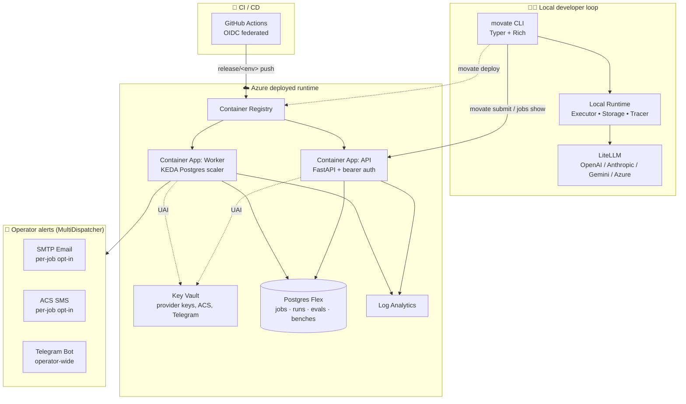

# movate v1.0 — what shipped

One-page architecture summary suitable for stakeholder reviews. Pairs
with [docs/dev-loop.md](dev-loop.md) (the developer-facing CLI flow)
and [BACKLOG.md](../BACKLOG.md) (the granular shipped list).

## The system

## Three layers

### 1. Local developer loop

A single `movate` binary covers the entire inner loop — scaffold,
validate, iterate, evaluate, benchmark, deploy. The CLI is Typer +
Rich with `--help` panels grouping commands by phase (Develop /
Run & evaluate / Diagnose / Deploy & operate). All commands share
one local runtime: a typed `Executor` over a `BaseLLMProvider`
Protocol (LiteLLM today; mock provider for tests; swap-in for any
future vendor without leaking abstraction).

### 2. Azure deployed runtime

Single-tenant ACA deployment per environment (dev / staging / prod),
provisioned by one `main.bicep` orchestrator over seven modules:
ACR, Key Vault, Log Analytics, Postgres Flex, Container Apps Env,
and the two apps. Identities are user-assigned (created at the
top level, so role assignments grant access BEFORE the apps come up
— this avoided a real chicken-and-egg deadlock we hit on a cold
deploy). KEDA scales the worker on Postgres queue depth (claimable
jobs), not CPU.

Cost: ~$50/mo idle on dev; ~$300-500/mo on prod (per
[docs/v1.0-azure-design.md](v1.0-azure-design.md)).

### 3. Operator alert fan-out

When a worker lands a terminal job, a `MultiDispatcher` fires every
configured channel:

* **Email (SMTP)** — vendor-agnostic. Per-job opt-in via
  `--notify-email <addr>`.
* **SMS (Azure Communication Services)** — Azure-native, A2P 10DLC
  registered. Per-job opt-in via `--notify-sms +1...`.
* **Telegram bot** — operator-wide alert. Free, no regulatory tax,
  cross-platform. Fires on EVERY terminal job when env is configured.
  Right shape for personal dev-loop notifications.

Channel selection is env-driven at worker startup; backends silently
degrade to console-only when their config is absent.

## What's tenant-isolated

Every storage read/mutate path filters by `tenant_id` at the SQL
WHERE clause — runs, evals, benches, workflow runs, jobs, API keys,
tenant budgets. Cross-tenant lookups return `None` (never 403, which
would leak existence). Same enforcement on the HTTP API surface,
backed by parametrized fuzz tests over all three storage backends.

## Determinism for workflows (v1.1)

Workflow execution rides on a homegrown IR (`WorkflowGraph` with
`NodeType` + `EdgeKind` enums) that compiles to either:

* The homegrown runner (linear DAGs, v0.3 default).
* LangGraph (conditional + parallel + HITL — opt-in via
  `runtime: langgraph` in workflow.yaml).

The LangGraph compiler supports `interrupt_before` for HUMAN nodes
+ tenant-namespaced checkpointers (sqlite or postgres) for pause &
resume across processes. Resume API + HITL nodes shipped together
so the operator can submit a workflow, the worker pauses at a HUMAN
node, an external system POSTs to `/workflows/{id}/resume` with the
operator decision, and execution continues from the checkpoint.

## Quality gates as code

* `movate eval --gate 0.7 --baseline <id>` — dataset evals with
  CI-gateable score regression detection. Cross-family judge
  enforcement (the judge can't share a vendor family with the
  agent under test).
* `movate bench --baseline <id> --regression-tolerance 0.05` — multi-
  model comparison with cost/latency/score deltas vs a stored
  baseline. Per-model regression flags fire CI non-zero exit.
* Tenant-scoped monthly cost ceiling enforced at executor entry
  (zero provider cost on a budget-blocked run).

## Observability

* Langfuse (LLM-specific traces) + OTel (general-purpose) both
  configurable via env. Span attributes include cost_usd,
  pricing_version, tokens.input/output/cached_input on every
  provider call — Langfuse/Grafana dashboards can filter on
  pricing_version drift without joining back to RunRecord.
* `movate trace replay <run-id>` reconstructs a run/workflow's
  node-by-node execution from stored RunRecords.

## What's not in v1.0 (deferred to v1.1+)

| Item | Reason |
|---|---|
| RBAC + Azure AD SSO | Multi-user auth deferred; v1.0 is bearer-token API keys |
| LangGraph TOOL / FUNCTION / SUB_WORKFLOW nodes | `can_compile` rejects with operator-facing error pointer — each unlocks one rejection branch |
| DeepEval / Ragas / TruLens | Defer until a RAG agent ships to production |
| HTTP streaming (`POST /run?wait=true` SSE) | Polling is fine for batch / dev-team flows; reconsider when interactive UIs land |
| Multi-region failover | Single-region by design; customers are single-region |

## Numbers (as of this PR landing)

* ~770+ unit tests, all CI-green
* 5 PRs in the active stack from the most recent work (SMS via ACS,
  Telegram alerts, polish batch, Bicep UAI fix, bench persistence)
* 3 storage backends parametrized across the test suite
  (in-memory, sqlite, postgres)
* End-to-end validated against a real Azure subscription
  ([Tier 1 #3 in BACKLOG](../BACKLOG.md))

## Roadmap snapshot

### Next 1 week (Tier B polish)

1. More agent templates (extractor, RAG, function-caller) — most
   customer-visible "what can I build" answer.
2. `movate logs <run-id> --tail` — pairs with Telegram alerts (alert
   lands → check what happened).
3. Privacy redaction (`tracer.redact_io: true`) — gates real
   customer onboarding (PII in spans).
4. Rubric library (5 standard judges).

### Next 1 month (real features)

* HTTP streaming for `POST /run?wait=true` (interactive UI use case)
* `/run` idempotency by `request_id` (CI retry safety)
* `workflow_runs` linking table (parent → child run lineage)
* LangGraph TOOL / FUNCTION node compilation

### Operator-side (parallel, not code)

* A2P 10DLC brand registration with The Campaign Registry (~2-3
  weeks) if customer-facing SMS is a real product surface.
